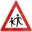

# Traffic Sign Recognition

## Build a Traffic Sign Recognition Project

The goals / steps of this project are the following:

- Load the data set (see below for links to the project data set)
- Explore, summarize and visualize the data set
- Design, train and test a model architecture
- Use the model to make predictions on new images
- Analyze the softmax probabilities of the new images
- Summarize the results with a written report

## Rubric Points
### Here I will consider the [rubric points](https://review.udacity.com/#!/rubrics/481/view) individually and describe how I addressed each point in my implementation.  

### Writeup / README

#### 1. Provide a Writeup / README that includes all the rubric points and how you addressed each one.

You're reading it! and here is a link to my [project code](https://github.com/wujiang/CarND-Traffic-Sign-Classifier-Project/blob/master/Traffic_Sign_Classifier.ipynb)

### Data Set Summary & Exploration

#### 1. Provide a basic summary of the data set.

I used the pandas library to calculate summary statistics of the traffic
signs data set:

- The size of training set is 34799 (`X_train.shape[0]`)
- The size of the validation set is 4410 (`X_valid.shape[0]`)
- The size of test set is 12630 (`X_test.shape[0]`)
- The shape of a traffic sign image is (32, 32, 3)  (`X_train.shape[1:4]`)
- The number of unique classes/labels in the data set is 43 (`np.unique(y_train).shape[0]`)

#### 2. Include an exploratory visualization of the dataset.

Here is an exploratory visualization of the data set. It is a bar chart showing
the distribution of the features.

### Design and Test a Model Architecture

#### 1. Describe how you preprocessed the image data. What techniques were chosen and why did you choose these techniques? Consider including images showing the output of each preprocessing technique. Pre-processing refers to techniques such as converting to grayscale, normalization, etc. (OPTIONAL: As described in the "Stand Out Suggestions" part of the rubric, if you generated additional data for training, describe why you decided to generate additional data, how you generated the data, and provide example images of the additional data. Then describe the characteristics of the augmented training set like number of images in the set, number of images for each class, etc.)

1. thanks to Paul's suggestion, I managed to enlarge the training set by 2 times
   by adding augmented images. For each original image, I added 5 more augmented
   images. I used the code from https://github.com/vxy10/ImageAugmentation to
   alter the image rotation, alter brightness, and get partial images from the
   original images. Adding more training data with different varianties can make
   the model more robust and gain better results. Example
   images:

   - original:
    
   
   - augmented:
   

2. turn the images into grayscale
  - different color channels do not matter much for CNN
  - reduce the data size
  - the drop-in LaNet uses 1 channel
3. apply normalization

Here is an example of a traffic sign image before and after grayscaling.

As a last step, I normalized the image data because

- it fixes the range to be the same for all data

#### 2. Describe what your final model architecture looks like including model type, layers, layer sizes, connectivity, etc.) Consider including a diagram and/or table describing the final model.

My final model consisted of the following layers:

| Layer         		|     Description	        					| 
|:---------------------:|:---------------------------------------------:| 
| Input         		| 32x32x1 grayscale image						| 
| Convolution 5x5     	| 1x1 stride, same padding, outputs 28x28x6 	|
| RELU					|												|
| Max pooling	      	| 2x2 stride,  outputs 14x14x6  				|
| Convolution 2x2	    | 1x1 stride, same padding, outputs 10x10x16	|
| RELU					|												|
| Max pooling	      	| 2x2 stride,  outputs 5x5x16   				|
| Fully connected		| input 400, output 120							|
| RELU					|												|
| Fully connected		| input 120, output 84							|
| RELU					|												|
| Fully connected		| input 84, output 43							|
|						|												|
|						|												|
 
#### 3. Describe how you trained your model. The discussion can include the type of optimizer, the batch size, number of epochs and any hyperparameters such as learning rate.

To train the model, I used an the LeNet5 from the class. Only modified the
`EPOCHS` and `BATCH_SIZE` to improve the results. 

- optimizer is Adam optimizer
- learing rate equal 0.001 
- batch size is 100
- number of epochs is between 10 and 50. It will terminate if the validation
  accuracy variance for the latest 5 epochs is smaller than 0.0000001 (a random
  small number).

#### 4. Describe the approach taken for finding a solution and getting the validation set accuracy to be at least 0.93. Include in the discussion the results on the training, validation and test sets and where in the code these were calculated. Your approach may have been an iterative process, in which case, outline the steps you took to get to the final solution and why you chose those steps. Perhaps your solution involved an already well known implementation or architecture. In this case, discuss why you think the architecture is suitable for the current problem.

My final model results were:

- training set accuracy of 0.992
- validation set accuracy of 0.939
- test set accuracy of 0.923

If an iterative approach was chosen:

- What was the first architecture that was tried and why was it chosen?

The LaNet5 from lab.

- What were some problems with the initial architecture?

Validation accuracy is below 0.93.

- How was the architecture adjusted and why was it adjusted? Typical adjustments
  could include choosing a different model architecture, adding or taking away
  layers (pooling, dropout, convolution, etc), using an activation function or
  changing the activation function. One common justification for adjusting an
  architecture would be due to overfitting or underfitting. A high accuracy on
  the training set but low accuracy on the validation set indicates over
  fitting; a low accuracy on both sets indicates under fitting.

I only changed `EPOCHS` and `BATCH_SIZE`.

- Which parameters were tuned? How were they adjusted and why?

  - EPOCHS: increaing epochs mean increasing the number of forward and backward passes
  - BATCH_SIZE: with bigger batch size, we get better accuracy for the training
    set with the same number of epochs, but if batch size is too high, it may
    cause over-fitting.
  
- What are some of the important design choices and why were they chosen? For
  example, why might a convolution layer work well with this problem? How might
  a dropout layer help with creating a successful model?
  
  I didn't use dropout but I think in theory random dropout can reduce over-fitting.

### Test a Model on New Images

#### 1. Choose five German traffic signs found on the web and provide them in the report. For each image, discuss what quality or qualities might be difficult to classify.

Here are five German traffic signs that I found on the web:

#### 2. Discuss the model's predictions on these new traffic signs and compare the results to predicting on the test set. At a minimum, discuss what the predictions were, the accuracy on these new predictions, and compare the accuracy to the accuracy on the test set (OPTIONAL: Discuss the results in more detail as described in the "Stand Out Suggestions" part of the rubric).

Here are the results of the prediction:

| Image			        |     Prediction	        					| 
|:---------------------:|:---------------------------------------------:| 
| Stop Sign      		| Stop sign   									| 
| No entry              | No entry 										|
| Children crossing     | Children crossing                             |
| Speed limit (50km/h)	| Speed limit (50km/h)                          |
| Speed limit (70km/h)	| Speed limit (20km/h)                          |

The model was able to correctly guess 4 out of the 5 traffic signs, which gives
an accuracy of 80%. This compares favorably to the accuracy on the test set of
92.3%. The reason is that Speed limit (70km/h) has a background with many
different colors forms some patterns.

#### 3. Describe how certain the model is when predicting on each of the five new images by looking at the softmax probabilities for each prediction. Provide the top 5 softmax probabilities for each image along with the sign type of each probability. (OPTIONAL: as described in the "Stand Out Suggestions" part of the rubric, visualizations can also be provided such as bar charts)

### (Optional) Visualizing the Neural Network (See Step 4 of the Ipython notebook for more details)
####1. Discuss the visual output of your trained network's feature maps. What characteristics did the neural network use to make classifications?

